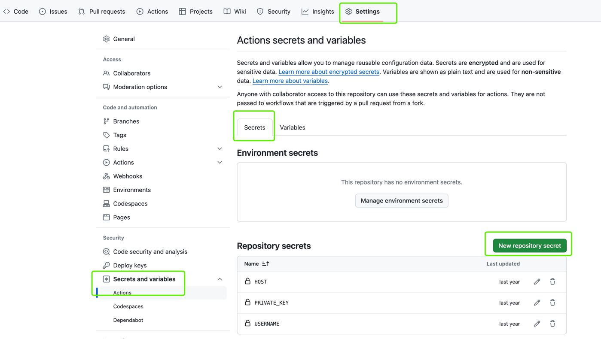

# github actions实现自动部署

### 1、在你的项目新建一个`.github/workflows/deploy.yml`文件

```yaml
name: freeDom
on: [push]
jobs:
  # 定义一个作业名称
  buildProject:
    runs-on: ubuntu-latest
    steps:
      # 1、下载代码
      - uses: actions/checkout@v4
      # 2、安装pnpm
      - uses: pnpm/action-setup@v3.0.0
        with:
          # 我本地的pnpm是这个版本所以设置用这个版本，具体看个人
          version: '8.15.6'
      # 3、安装依赖
      - name: pnpm下载依赖
        run: pnpm install
      # 4、构建项目
      - name: pnpm构建项目
        run: pnpm build
      # 5、上传构建好的文件到服务器
      - name: 上传到服务器
        uses: easingthemes/ssh-deploy@v4.1.8
        with:
          # 私钥 （如何配置看第二步）
          SSH_PRIVATE_KEY: ${{ secrets.SSH_PRIVATE_KEY }}
          # 服务器地址（输入ip就好不要加http啥的）
          REMOTE_HOST: ${{ secrets.REMOTE_HOST }}
          # 服务器用户名我的是root
          REMOTE_USER: ${{ secrets.REMOTE_USER }}
          # 你需要将哪个文件夹上传到服务器上
          SOURCE: ./blog
          # 你需要上传到服务器上的文件目录
          TARGET: /usr/local/nginx/html
          # 不加这个报错 Permission denied, please try again.
          SCRIPT_BEFORE: ls
```
### 2、配置服务器的SSH_PRIVATE_KEY [ssh-deploy](https://github.com/easingthemes/ssh-deploy)

```shell
# 1、登录你的服务器
ssh root@139.199.178.253
# 2、生成密钥
ssh-keygen -m PEM -t rsa -b 4096
# 3、复制你的私钥(第三步有用)
cat .ssh/id_rsa
# 4、将你的公钥复制到ssh下的 authorized_keys文件中
vim .ssh/authorized_keys
```
### 3、去github上配置 SSH_PRIVATE_KEY、REMOTE_HOST、REMOTE_USER
>因为第一步中我们需要将我们打包好的文件上传到服务器上，所以我们需要让github知道我们的服务器信息
上传服务器的包是ssh-deploy, 具体配置请阅读文档 [ssh-deploy](https://github.com/easingthemes/ssh-deploy)·

1、找到如下位置添加三个变量，具体变量名称由你的第一步中的第五步决定

```shell

```
